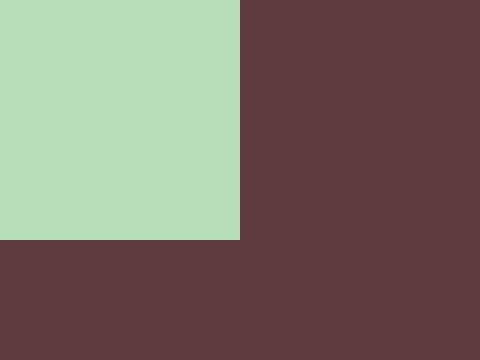

# Colection of solvedd CSS challenges from CSSBattle.com:

## Battle
#### 001.-SimplySquare

#### 002.-Carrom  

\003.-PushButton  \
004.-UpsnDowns  \
005.-AcidRain  \
006.-MissingSlice  \
007.-LeafyTrail  \
008.-FrokingCrazy  \
009.-Tesseract  \
010.-CloakedSpirit 

