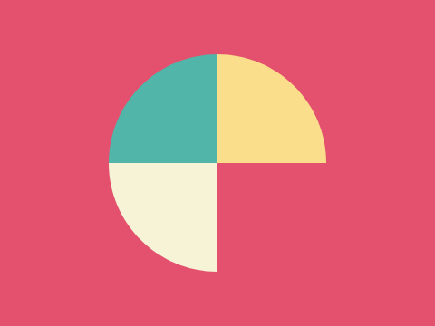
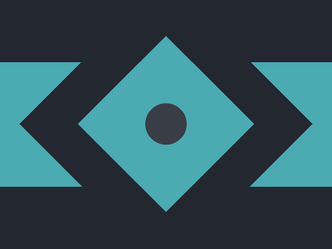

# CSS challenges from CSSBattle.com:

## Solved chalenges from Battle

#### [001.-SimplySquare](battles/001.-SimplySquare/index.html)
#### [002.-Carrom](battles/002.-Carrom/index.html)
#### [003.-PushButton](battles/003.-PushButton/index.html)
#### [004.-UpsnDowns](battles/004.-UpsnDowns/index.html)

   

#### [005.-AcidRain](battles/005.-AcidRain/index.html)

#### [006.-MissingSlice](battles/006.-MissingSlice/index.html)

#### [007.-LeafyTrail](battles/007.-LeafyTrail/index.html)

#### [008.-FrokingCrazy](battles/008.-FrokingCrazy/index.html)

#### [009.-Tesseract](battles/009.-Tesseract/index.html)

#### [010.-CloakedSpirit](battles/010.-CloakedSpirit/index.html)

